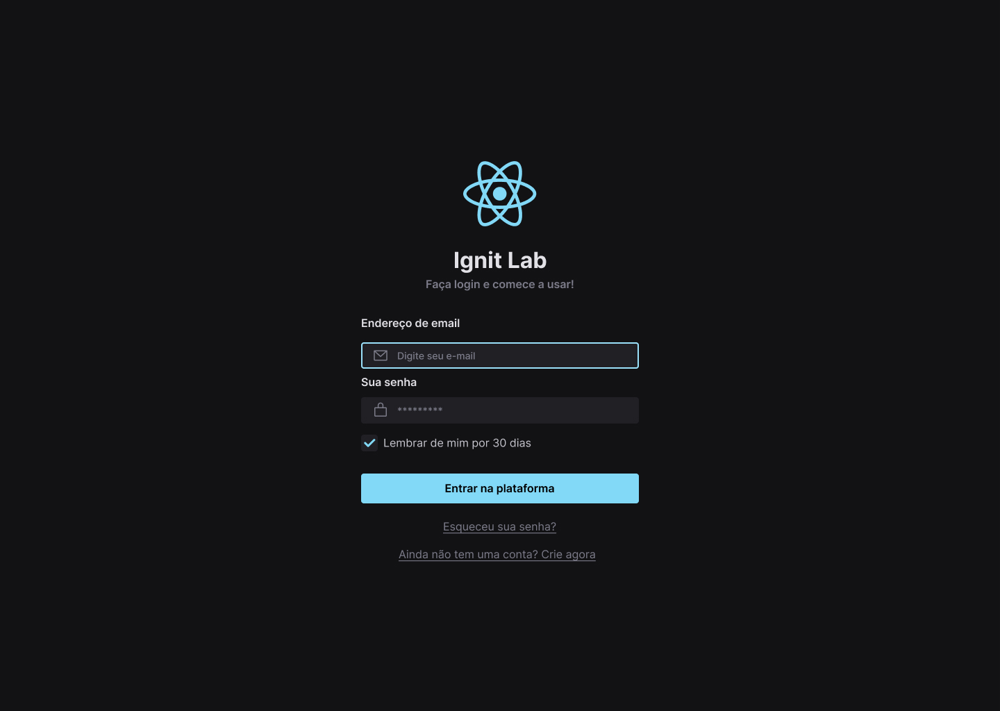

# Ignite-Lab
## Desenvolvendo um design system do Figma ao Código

### Técnologias Utilizadas

-Figma ->https://www.figma.com/
-React –>https://pt-br.reactjs.org
-Tailwind -> https://tailwindcss.com/
-Radix-UI -> https://www.radix-ui.com/.
-Storybook -> https://storybook.js.org/

